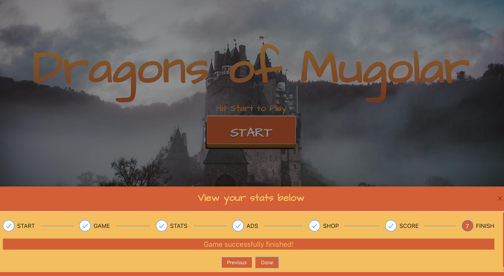
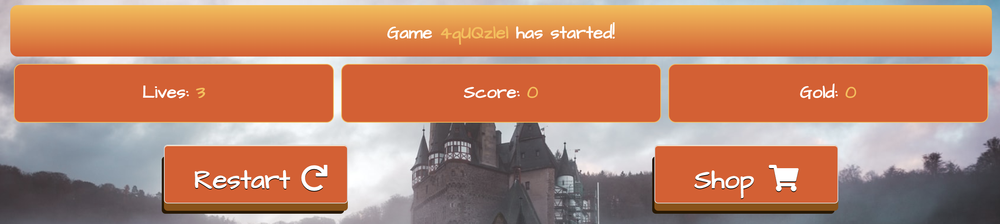
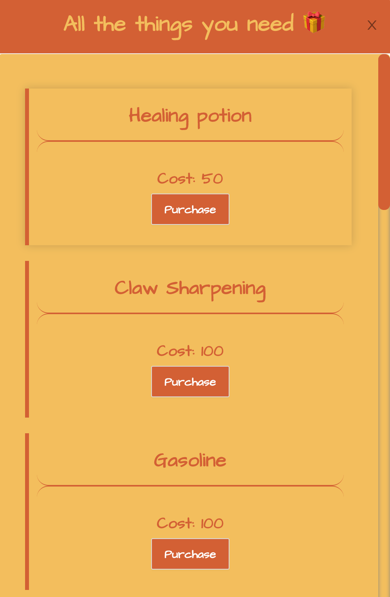
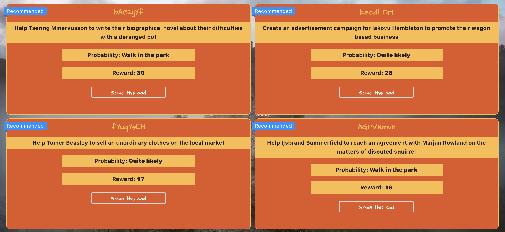
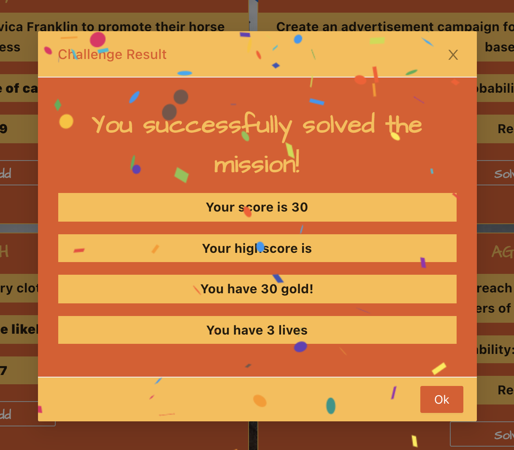

# **Dragons of Mugloar**

**Visual Experience** for **Dragons og Mugloar Game**. 

For more information about the game itself and the nicely documented APIs, you can visit the following website: [Dragons of Mugloar](https://dragonsofmugloar.com/)

## Technologies used to develop the Frontend Visual Experience

> React, Ant Design, React+Redux, Styled Components.

## Installation

- Download or clone this repository to your local machine: 
```
git clone https://github.com/mirlindm/Dragons-of-Mugolar.git
``` 
- Open it in your preferred code editor 
- Navigate to the MUGLOAR_UI folder
- For installing the dependencies, run the command: 
```
npm install
``` 
- For starting the server, run the command: 
```
npm start
``` 
- You will be redirected to the browser, but nevertheless, you might as well navigate to: localhost:3000

- To run the tests, located in: ``` /src/utils/utils.test.js``` , run the commmand:
```
npm test
```

## About the Application

The Kingdom of Mugloar has noticeably changed over the short time of just a few years – it was not long ago when the state officials introduced a skilled dragon trainer to the country’s payroll to train the scaly beasts to protect our lands against invading knights, hungry for royal hands in marriage – princess or miscellaneous. The dragon trainer was successful in fending off the knights and making dragons commonplace in the Mugloarian everyday...

## Dragons of Mugloar GIFs

<br /> <br />

<br /> <br />


## Dragons of Mugloar Screenshots







## Contributing
Pull requests are welcome. For major changes, please open an issue first to discuss what you would like to change.

## License
[MIT](https://choosealicense.com/licenses/mit/)

## Contact
@: mirlindmurati@outlook.com
