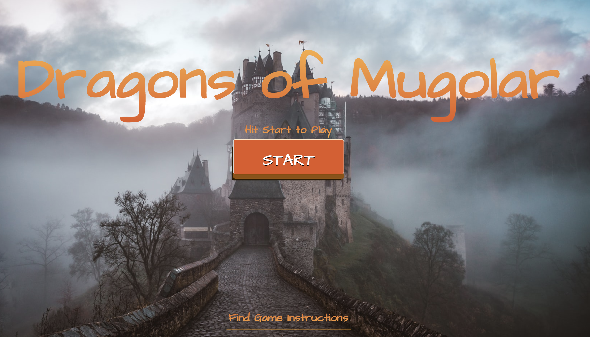

# **Dragons of Mugloar**

**Visual Experience** for **Dragons og Mugloar Game**. 

For more information about the game itself and the nicely documented APIs, you can visit the following website: [Dragons of Mugloar](https://dragonsofmugloar.com/)

## Technologies used to develop the Frontend Visual Experience

> React, Ant Design, React+Redux, Styled Components.

## Installation

- Download or clone this repository to your local machine: 
```
git clone https://github.com/mirlindm/Dragons-of-Mugolar.git
``` 
- Open it in your preferred code editor 
- Navigate to the MUGLOAR_UI folder
- For installing the dependencies, run the command: 
```
npm install
``` 
- For starting the server, run the command: 
```
npm start
``` 
- You will be redirected to the browser, but nevertheless, you might as well navigate to: localhost:3000

- To run the tests, located in: ``` /src/utils/utils.test.js``` , run the commmand:
```
npm test
```

## About the Application

The Kingdom of Mugloar has noticeably changed over the short time of just a few years – it was not long ago when the state officials introduced a skilled dragon trainer to the country’s payroll to train the scaly beasts to protect our lands against invading knights, hungry for royal hands in marriage – princess or miscellaneous. The dragon trainer was successful in fending off the knights and making dragons commonplace in the Mugloarian everyday...

## How it works, briefly...

- Upon application start, user can either begin to play or check out game instructions.
- When the game is started, user's stats are displayed on the screen (score, lives and gold) and they change accordingly.
- User can restart the game by clicking on the Restart button or refreshing the browser.
- User can view the shop and purchase an item (Healing Potion in this case, as purchasing other items is not supported so far).
- A list of challenges/ads are shown on the screen for the user to tackle:
    - Ads are filtered/Hints are given to the user: 
    1. Ads containing gibberish messages or id-s are not taken into consideration
    2. Ads with rewards equal to and higher than 140 are deemed as Traps (observed pattern)
    3. Hints are given to the user on which ads to solve, based on ads' properties (reward, probability, etc.)

- User gets a warning when the number of lives is 1, so that a Healing Potion from the shop can be purchased
- User gets a success notification when the score reaches 1000!
- Game is over when there are no more lives remaining and a new game begins shortly after.      

## Application Structure
    
    MUGOLAR_UI
    .
    ├── public                  # Application <html> </html> and favicon
    ├── src                     # Documentation files (alternatively `doc`)
    ├── src                     # Source files 
        |── assets              # Images and screenshots used in the application and README.md file
        |── components          # Reusable components, such as custom styled Buttons and Modal 
        |── pages               # Application pages that carry on and showcase different application facets 
        |── services            # Application service to interact and consume the exposed APIs 
        |── styles              # Styled components that are reused in various other components 
        |── utils               # Functions used to calculate game ads' scores and provide hints to the user
        |── App.js              # Contains main logic and renders all other components used in the application
        |── index.css           # Customizing the application styles and overwriting Ant Components design
        |── index.js            # Rendering the whole application through the linked <html> </html>
        |── reportWebVitals
        |── setupTests.js
    ├── .gitignore              # Application files to ignore when committing to the remote repository
    ├── package-lock.json       # Tracking installed packages version throughout the application
    ├── package.json            # Application dependencies/packages (install them through *npm install* ) 
    └── README.md               # Application thorough description

## Dragons of Mugloar GIFs


<br /> <br />


## Dragons of Mugloar Screenshots



## TODO in the application (a couple of improvements that can be done)

- Use a state management library such as Redux, MobX, etc., in order to have a centralized global state and access game details directly from the shared store. Currently, the state is managed through passing the props among components (not the ideal practice), as the application is rather small. 

- With a global shared store for managing application state, in place, it would enable to extract more dedicated components in the application.

- Improve the logic of the functions that provide recommendations to the user in terms of solving the challenges.

- Implement purchasing the entire collection of items from the shop and update the stats accordingly.

- Testing the React components thoroughly through Jest or React Testing Library. 

## Contributing
Pull requests are welcome. For major changes, please open an issue first to discuss what you would like to change.

## License
[MIT](https://choosealicense.com/licenses/mit/)

## Contact
@: mirlindmurati@outlook.com
